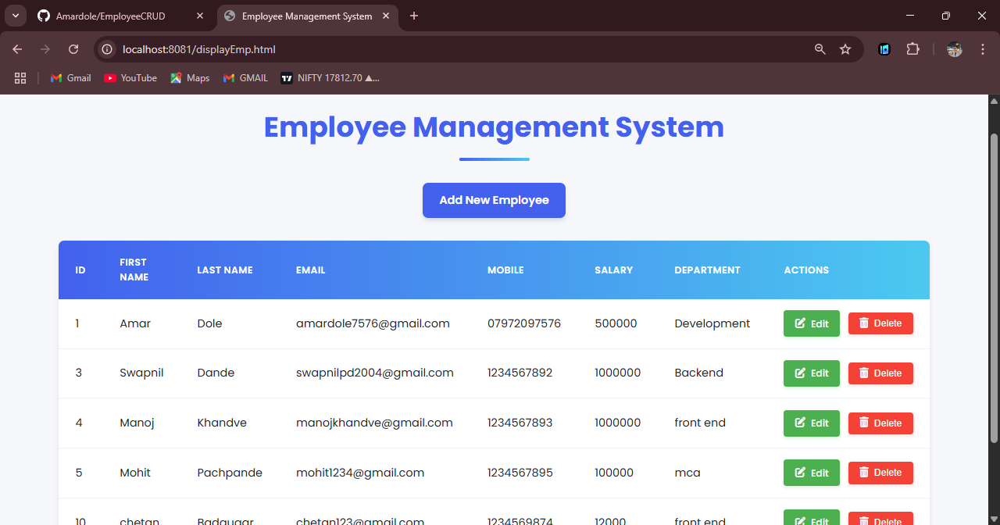
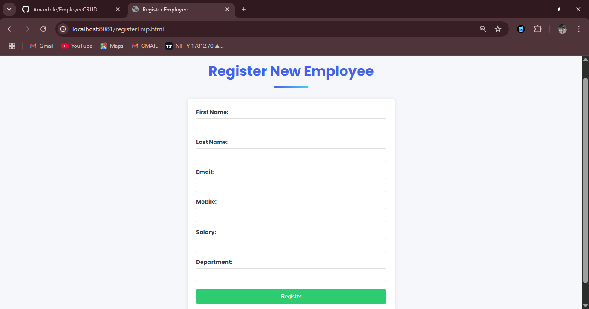
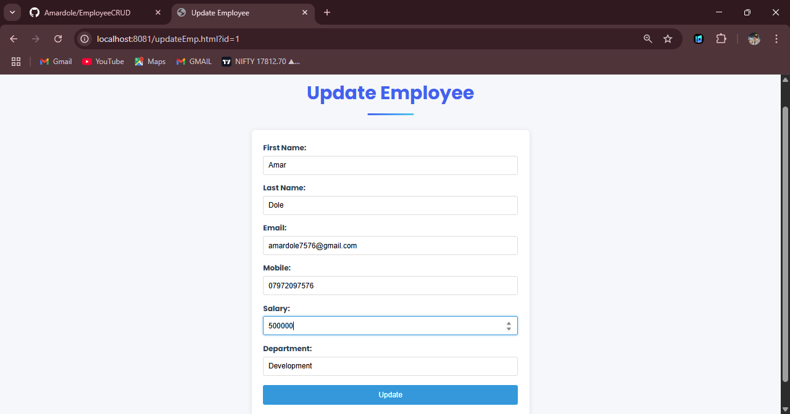
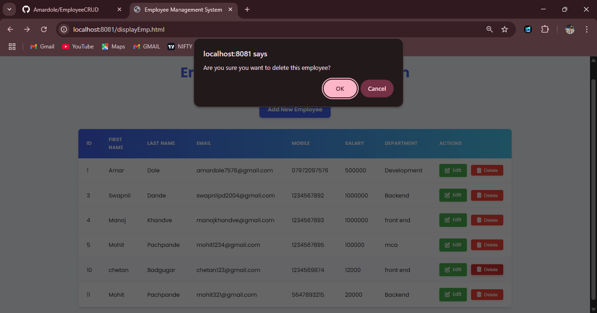

# Employee Management System
A modern web application for managing employee records with CRUD functionality, built with Java Servlets, JPA/Hibernate, and embedded Tomcat.


##Display All Employees


##insert Employees


##update Employee Records.


##Delete Perticular Employee


## Features

### Core Functionality
- **Full CRUD Operations**:
  - Create new employee records
  - Read/View all employee data
  - Update existing employee information
  - Delete employee records
- **Responsive UI** with clean, modern design
- **Real-time data validation** for all form fields
- **Interactive confirmation** for delete operations

### Advanced Features
- **Database Integration**:
  - PostgreSQL relational database
  - JPA/Hibernate ORM for data persistence
  - Automatic table generation
- **Server Architecture**:
  - Embedded Tomcat server
  - RESTful API design
  - Proper transaction management
- **User Experience**:
  - Pagination support (future enhancement)
  - Search/filter functionality (future enhancement)
  - Export to CSV/Excel (future enhancement)

## Technology Stack

### Frontend
- HTML5, CSS3 (with modern Flexbox/Grid)
- Vanilla JavaScript (ES6+)
- Responsive design (works on mobile/tablet/desktop)

### Backend
- Java Servlets
- JPA (Java Persistence API)
- Hibernate ORM
- Embedded Tomcat 10

### Database
- PostgreSQL (can be configured for other RDBMS)

### Development Tools
- Maven/Gradle (dependency management)
- Git (version control)
- VS Code/Spring Tool Suit (STS) (development)

## Installation & Setup

### Prerequisites
- Java JDK 11+
- Maven 3.6+
- PostgreSQL 12+
- Git

### Steps
1. Clone the repository:
   ```bash
   git clone https://github.com/your-username/employee-management-system.git
   cd employee-management-system
